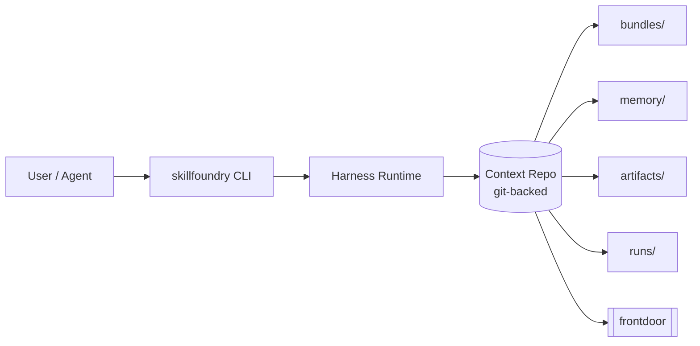

# skillfoundry-harness

Runtime harness for git-backed agent context repositories.

## At a glance

- Installable Python package (`pip install -e .`) exposing a `skillfoundry` CLI and a `Runtime` API.
- Owns runtime semantics, repository contracts, schema validation, and CLI entrypoints for operating on agent *context repos*.
- Works against any compliant context repo without importing workspace-local code.
- Does **not** own the agent registry / coordination hub, and does **not** embed long-lived context content or agent-specific memory.

## Why this exists

Agents need durable state that outlives any single runtime instance. This harness draws a hard boundary around the **context repository** — a git-backed directory with an explicit layout — and treats it as the canonical artifact. Runtimes are ephemeral processes that open that repo, read validated bundles, write run-scoped outputs, and go through an explicit propose/approve/apply flow for anything that enters canonical memory.

Keeping validation, promotion policy, and repository contracts in one pip-installable package means multiple context lineages can share the same runtime semantics without copy-pasted harness code.

## Quickstart

Requires Python 3.12+.

```bash
python3 -m venv .venv
source .venv/bin/activate
python3 -m pip install -e .

# Point the CLI at any compliant context repo
skillfoundry describe /path/to/context-repo
skillfoundry validate /path/to/context-repo
```

To bootstrap a fresh lineage instead: `skillfoundry init-context /tmp/demo-context --agent-id demo --name "Demo Context"`. Run the test suite with `python3 -m unittest discover -s tests`.

## What works today

Verified against `src/skillfoundry_harness/` and `cli.py`:

- `Runtime.open(path)` — open a validated context repo.
- Context lineage bootstrap: `init-context`, `fork-context`.
- Validation and inspection: `validate`, `describe`, `frontdoor`, `list-bundles`, `show-bundle`.
- Branch-local bounded workspaces: `branch-describe`.
- Managed git worktrees for isolated subagent execution: `worktree-create`, `worktree-list`, `worktree-remove`.
- Explicit canonical-memory flow: `propose-memory`, `branch-propose-memory`, `show-proposal`, `approve-proposal`, `apply-proposal`.
- Durable validation artifacts (`record-validation`), approval records, and content-pinned proposal/validation/approval artifacts enforced at apply time.
- JSON Schema for context bundles under `schemas/context-bundle.schema.json`.
- `thread`, `turn`, and `run` records persisted under `runs/`.
- stdlib `unittest` test suite under `tests/`.

Intended but not yet in scope here: agent registry, hub/coordination, chat orchestration UX, long-lived context authoring tools.

## Architecture



## Repository contract

A valid context repo exposes one config file and four explicit roots:

| Root | Purpose |
|------|---------|
| `bundles/` | Reviewed, schema-validated context inputs consumed by runtimes. |
| `memory/` | Long-lived canonical state. Only mutated via the propose / approve / apply flow. |
| `artifacts/` | Durable generated outputs, including validation, approval, and proposal snapshots. |
| `runs/` | Execution-scoped records: `thread`, `turn`, `run`. Ephemeral relative to canon. |
| `[frontdoor]` (config) | Progressive-disclosure manifest pinning what a fresh runtime sees first. |

See [docs/CONTEXT_REPOSITORY_CONTRACT.md](docs/CONTEXT_REPOSITORY_CONTRACT.md) for the authoritative contract.

## Design choices

- **The context repo is the canonical artifact.** Runtime processes are replaceable; the repo is not.
- **Runtime instances are ephemeral.** They read canon, write run-scoped output, and exit. Nothing in `runs/` is canonical by default.
- **Promotion into canon is explicit and reviewed.** Memory updates flow through proposal -> validation artifact -> approval artifact -> apply, with content-pinned references so apply gates a reviewed immutable change rather than mutable paths.
- **Harness owns validation and promotion policy.** The repo declares structure; the harness enforces it at apply time.
- **Bounded branch workspaces.** Branch-local drafts live under `artifacts/branches/<branch>/` and stay out of canon until promoted.

## Comparison

The harness is scoped to **repository boundaries and durable runtime semantics**. It is intentionally not a chat orchestration UX, not an agent registry, and not a model router. If you need conversational front-ends or coordination of many agents, those concerns live elsewhere (see below).

## Related repos

- **skillfoundry-agents** — workspace and agent topology, agent profiles, hub concerns.
- **atlas** — causal and research-oriented reasoning substrate.

## How this fits into the broader system

- `atlas` — causal / research reasoning layer.
- `skillfoundry-agents` — workspace and agent topology, profiles, registry/hub.
- `skillfoundry-harness` (this repo) — runtime semantics and context-repo operations consumed by the above.

## Deeper references

- [docs/CONTEXT_REPOSITORY_CONTRACT.md](docs/CONTEXT_REPOSITORY_CONTRACT.md) — repository contract.
- [docs/DESIGN_SYNTHESIS.md](docs/DESIGN_SYNTHESIS.md) — external ideas that shaped the harness primitives.
- [docs/ARCHITECTURE.md](docs/ARCHITECTURE.md), [docs/REPO_POLICY.md](docs/REPO_POLICY.md).

## Suggested GitHub metadata

**Description:**

> Runtime harness for git-backed agent context repositories, validation, and durable execution artifacts.

**Topics:** `ai-agents`, `context-repository`, `agent-runtime`, `python`, `cli`, `git-backed`, `schema-validation`, `agent-infrastructure`, `skillfoundry`
